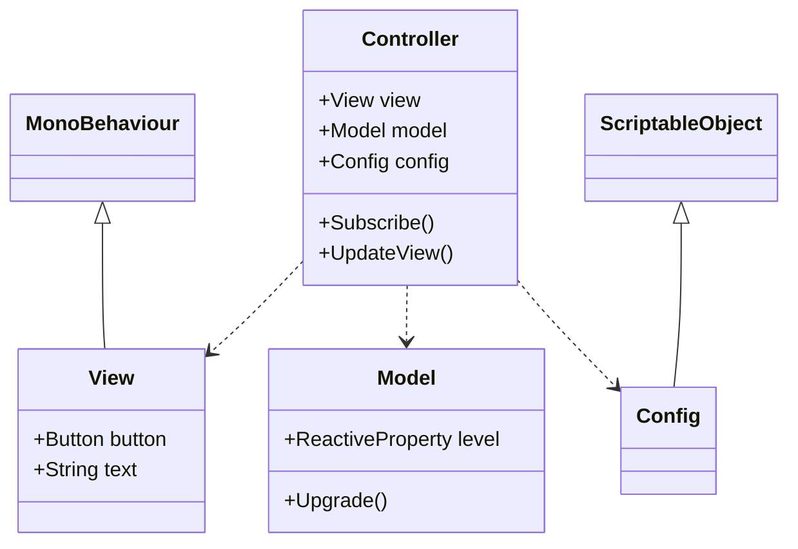

Example class diagram based on our MVC architecture:

```mermaid
classDiagram
	Controller ..> View
  Controller ..> Model
  Controller ..> Config

  MonoBehaviour <|-- View
  ScriptableObject <|-- Config
  
	class Controller{
    +View view
    +Model model 
    +Config config
    +Subscribe()
    +UpdateView()
  }
  class Model{
    +ReactiveProperty<int> level
    +Upgrade()
  }
  class View{
    +Button button
    +String text
  }
```